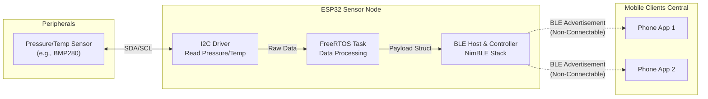

# ESP32 BLE Tire Telemetry System (TPMS Prototype)

This repository contains the embedded C firmware for a wireless Tire Pressure Monitoring System (TPMS) prototype. The system leverages an ESP32 microcontroller to acquire pressure and temperature data via I2C, structure it into Bluetooth Low Energy (BLE) advertisement packets, and broadcast it asynchronously.

## System Architecture

The firmware is built using the official **ESP-IDF** (Espressif IoT Development Framework) relying on FreeRTOS tasks to handle sensing and broadcasting efficiently without the overhead of maintaining a persistent GATT connection.



## Features
- **Connectionless BLE:** Uses non-connectable undirected advertising (`ADV_NONCONN_IND`) to broadcast telemetry data. This drastically lowers power consumption and allows multiple central devices to read the data simultaneously without pairing.
- **I2C Sensor Integration:** Low-level ESP-IDF I2C driver integration for real-time sensor acquisition.
- **FreeRTOS Task Scheduling:** Dedicated task for sampling at fixed intervals and updating the BLE advertisement payload dynamically.

## Project Structure
- `main/main.c` - System initialization, NimBLE stack setup, and FreeRTOS task creation.
- `main/sensor_i2c.c` - I2C master driver configuration and sensor reading logic.
- `main/ble_broadcaster.c` - Constructs the manufacturer-specific BLE payload containing the telemetry data.

## Building and Flashing
Ensure you have the ESP-IDF toolchain installed.

```bash
idf.py set-target esp32
idf.py build
idf.py -p COM_PORT flash monitor
```
