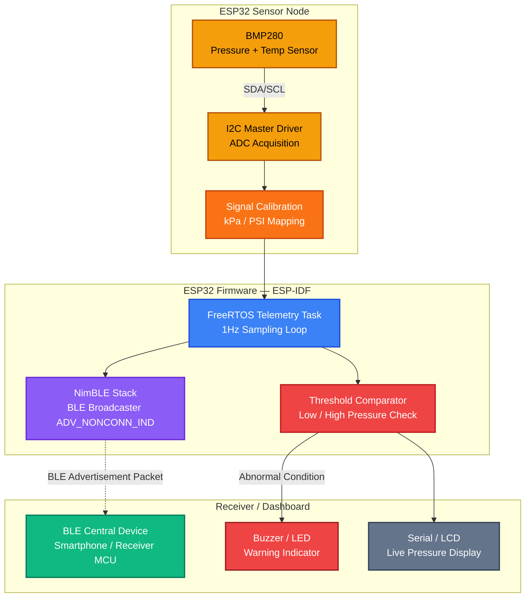

# Real-Time Tire Pressure Monitoring System (TPMS) Prototype

Real-Time Tire Pressure Monitoring System using Pressure Sensor, BLE Communication and Embedded Alert Logic on ESP32.

## Project Domain
Embedded Systems | Automotive Electronics | Vehicle Safety Systems | Sensor Monitoring | Telematics | Automotive ECU Prototyping

## Overview
This project is a functional embedded prototype of a Direct Tire Pressure Monitoring System (dTPMS) designed to continuously monitor tire pressure conditions and provide early warning alerts when abnormal under-inflation or over-pressure conditions occur.

The system simulates the core architecture used in modern passenger cars and EVs, where individual tire pressure sensing nodes collect real-time pneumatic pressure data, transmit it to a central monitoring controller, and generate driver notifications through a dashboard display or alert unit.

## Problem Statement
Improper tire pressure is one of the leading causes of tire blowouts, reduced braking stability, uneven wear, poor fuel efficiency, and vehicle handling instability. Modern vehicles address this using TPMS, where pressure sensors inside each wheel continuously monitor inflation conditions and send information to a TPMS ECU, which warns the driver in real time.

The objective of this project is to build a low-cost embedded prototype that replicates this direct TPMS sensing and warning workflow using consumer-grade hardware.

## System Architecture



## Hardware & Software Stack

### Hardware Components
| Component | Role |
|---|---|
| ESP32 Microcontroller | Main sensing and BLE broadcast node |
| BMP280 Pressure/Temp Sensor | I2C pressure and temperature acquisition |
| Buzzer / LED | Low and over-pressure warning indicator |
| LCD / Serial Monitor | Live pressure dashboard display |
| USB Power / Li-Po Battery | Node power supply |
| Pneumatic Chamber / Tire Valve | Pressure simulation medium |

### Software Stack
* **Framework:** ESP-IDF (Espressif IoT Development Framework)
* **RTOS:** FreeRTOS (task-based firmware architecture)
* **BLE Stack:** NimBLE (connectionless advertising)
* **Sensor Protocol:** I2C Master Driver

## TPMS Type: Direct (dTPMS)
This project follows **Direct TPMS Architecture** — an actual physical pressure sensor is used to directly measure tire air pressure. This differs from indirect TPMS, which estimates pressure from ABS wheel speed differentials. Real direct TPMS nodes also include a low-power MCU, RF transmitter, and battery packaged inside the wheel valve stem.

## Firmware Logic

The embedded firmware runs a continuous 1Hz sampling loop:

```
LOOP:
  sample BMP280 via I2C
  calibrate raw value → PSI / kPa
  package into BLE advertisement payload
  broadcast via NimBLE (ADV_NONCONN_IND)
  compare against thresholds
  trigger alert if LOW or OVER pressure
  delay 1000ms
```

Alert conditions:
- `pressure < MIN_THRESHOLD` → **LOW PRESSURE WARNING**
- `pressure > MAX_THRESHOLD` → **OVER PRESSURE WARNING**

## Communication Design

BLE non-connectable advertising (`ADV_NONCONN_IND`) is used so:
- Multiple central devices can receive data simultaneously without pairing
- Power consumption remains minimal (no connection overhead)
- Data is broadcast continuously in manufacturer-specific BLE payload

Each advertisement packet contains: `sensor_id | pressure_pa | temp_celsius | status_bit`

## Project Structure
```
esp32-ble-tpms/
├── main/
│   ├── main.c              # App entry, FreeRTOS task creation
│   ├── sensor_i2c.c        # I2C driver, BMP280 acquisition
│   ├── sensor_i2c.h
│   ├── ble_broadcaster.c   # NimBLE stack, advertisement payload
│   ├── ble_broadcaster.h
│   └── CMakeLists.txt
├── CMakeLists.txt
└── README.md
```

## Building and Flashing
Requires ESP-IDF v5.x installed and configured.

```bash
idf.py set-target esp32
idf.py build
idf.py -p <PORT> flash monitor
```

## Limitations
- Sensor node not mounted on a rotating wheel
- Pressure simulated via bench pneumatic chamber
- No automotive RF certification or CAN bus integration
- Single node prototype (production uses 4 independent wheel nodes)

## Future Enhancements
- Four independent tire sensor nodes
- Temperature compensation for altitude-adjusted readings
- RF-based wireless wheel sensor packaging (433 MHz / 315 MHz)
- CAN bus dashboard warning integration
- Mobile app telematics logging and cloud fleet analytics
